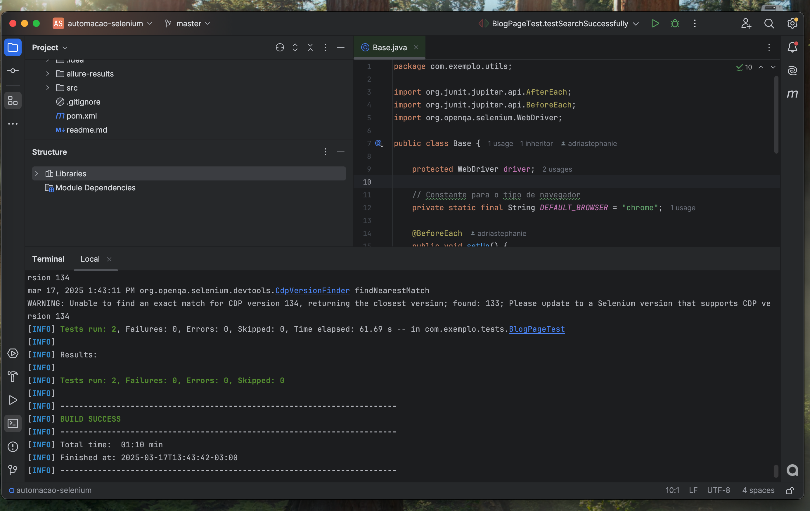

# Projeto

Utilizado Java, maven, JUnit 5, Selenium.

## Benefícios desta Estrutura

Organização: Separa claramente as responsabilidades em diferentes pacotes e classes.

Manutenibilidade: Ao usar o padrão Page Object Model, as alterações na interface da aplicação só precisam ser atualizadas em um único lugar (na classe da página correspondente).

Reutilização: Os métodos comuns estão nas classes base (BasePage e Base), evitando duplicação de código.

Legibilidade: Os testes ficam mais limpos e fáceis de entender, pois as ações estão encapsuladas nas classes de página.

Escalabilidade: É fácil adicionar novas páginas e novos testes sem alterar a estrutura existente.

Page Object Model: Usado muito com o java para entender e padronizar melhor a leitura da arquitetura, é indicado enforcement para selenium.

## Cenários

### Cenário 1: Verificar disponibilidade do Blog
Objetivo: Verificar se o sistema está funcionando

Acesse a página principal do blog.
Verifique se a página carrega com sucesso.

### Cenário 2: Pesquisa de Artigo Existente
Objetivo: Verificar se o sistema retorna o artigo correto ao pesquisar por um termo existente no blog.

Acesse a página principal do blog.
Na barra de pesquisa, digite o termo “limbo”.
Clique no botão de pesquisa.
Verifique se a página exibe resultados.

### Cenário 3: Pesquisa de Artigo Inexistente
Objetivo: Verificar se o sistema retorna mensagem de inexistente corretamente ao pesquisar por um termo que não tem post no blog.

Acesse a página principal do blog.
Na barra de pesquisa, digite o termo “tetete”.
Clique no botão de pesquisa.
Verifique se a página exibe resultados.
Verifique se a pagina trás a mensagem de feedback de post não encontrado


## Comandos

Roda os testes positivos:

```mvn test -Dgroups=funcional```

Roda os testes negativo passando navegador:

```mvn test -Dgroups=negativo```

Rodar todos os testes:

``` mvn test -Dtest=BlogPageTest  ```


## Estrutura

### maps: 

BlogSelectos.java: Responsável por Constantes para URLs e textos

### utils: 

Driver.java: Responsável por criar e gerenciar instâncias do WebDriver (browser). Implementa o padrão Singleton para garantir que haja apenas uma instância do WebDriver durante a execução dos testes.

Base.java: Classe base para todos os testes. Contém métodos que são executados antes e depois de cada teste (@BeforeEach e @AfterEach), como inicializar o driver e fechá-lo após a execução dos testes.

### pages: 

BasePage.java: Classe base para todas as páginas. Contém métodos comuns que podem ser utilizados em qualquer página, como clicar em elementos, escrever em campos, obter textos e verificar a existência e visibilidade de elementos.

BlogPage.java: Representa a página inicial . Contém os elementos e as ações específicas desta página, como acessar a URL, realizar pesquisas e verificar o título.


### tests: 

BlogPageTest.java: Contém os testes relacionados ao blog, como verificar se a página carrega corretamente e se a funcionalidade de pesquisa funciona etc.


## Evidencias




